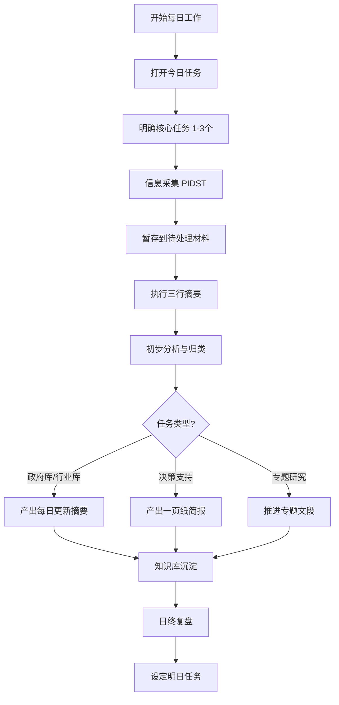

[根目录](../CLAUDE.md) > **00-每日工作区**

---

# 00-每日工作区 - 模块文档

> 最后更新：2025-12-03 17:32:18

---

## 变更记录 (Changelog)

### 2025-12-03
- 初始化模块文档
- 识别核心工作文件与流程

---

## 模块职责

**00-每日工作区** 是智库研究员日常工作的核心操作区域，负责：

- **任务管理**：明确每日核心任务与优先级
- **信息暂存**：临时存储待处理的原始材料
- **快速处理**：执行三行摘要与初步分析
- **项目跟踪**：管理当前进行中的专题项目
- **工作流执行**：按照六步日常循环完成每日工作

**设计理念**：快速响应、结构化处理、避免信息过载

---

## 入口与启动

### 每日启动流程（3分钟）

1. **打开今日任务文件**
   ```
   文件：00-今日任务.md
   ```

2. **明确核心任务**
   - 列出今日最重要的 1-3 个任务
   - 按任务类型分类（政府库/行业库更新、决策支持、专题研究）
   - 设定今日最小交付物（MVP）

3. **检查待处理材料**
   ```
   文件：01-待处理材料.md
   ```
   - 查看昨日遗留的待处理信息
   - 评估优先级

---

## 对外接口

### 输入接口

| 来源 | 内容类型 | 处理方式 |
|------|---------|---------|
| 外部信息源 | 政策文件、行业报告、新闻资讯 | 暂存到 `01-待处理材料.md` |
| 领导需求 | 决策支持请求、专题研究任务 | 记录到 `00-今日任务.md` |
| 日常监测 | PIDST 五维信息 | 按框架分类暂存 |

### 输出接口

| 目标 | 输出物 | 流向 |
|------|-------|------|
| 知识库 | 三行摘要 | → `03-行业研究库/` 或 `04-专题研究库/` |
| 领导/客户 | 一页纸简报、每日更新摘要 | → 外部交付 |
| 专题项目 | 证据链、观点、文段 | → `04-专题研究库/` |
| 个人成长 | 复盘记录、方法论总结 | → 知识沉淀 |

---

## 关键依赖与配置

### 依赖的方法论

1. **PIDST 五维框架**
   - P (Policy) - 政策层面
   - I (Industry) - 产业层面
   - D (Data) - 数据层面
   - S (Signals) - 信号层面
   - T (Technology) - 技术层面

2. **三行摘要法**
   ```markdown
   ### [材料名称]
   **1. What happened：** [发生了什么]
   **2. So what：** [意味着什么]
   **3. Now what：** [下一步如何]
   **标签：** 政策/行业/技术/数据
   **时间：** [信息时间]
   **来源：** [信息来源]
   ```

3. **证据链思维**
   - 事实（F）：客观发生的事件
   - 数据（D）：量化指标和统计数据
   - 政策（P）：相关政策文件和导向
   - 趋势（T）：行业和市场趋势
   - 弱信号（S）：早期预警信号

### 配置文件

- 参考：`../智库研究员工作流程指南.md`
- 参考：`../每日工作检查清单.md`

---

## 数据模型

### 今日任务结构

```markdown
# 今日任务 - [日期]

## 今日最重要的三件事（MIT）
1. [具体任务1]
2. [具体任务2]
3. [具体任务3]

## 任务类型分类
- 政府库/行业库更新：[具体内容]
- 决策支持：[具体项目]
- 专题研究：[具体专题推进]

## 今日最小交付物
- [明确的输出物描述]
```

### 三行摘要结构

```markdown
### [材料标题]
**1. What happened：** [事实描述]
**2. So what：** [意义分析]
**3. Now what：** [行动建议]
**标签：** [分类标签]
**时间：** [YYYY-MM-DD]
**来源：** [来源链接或名称]
```

### 专题项目跟踪结构

```markdown
### 项目名称
- **研究问题：** [核心问题]
- **开始时间：** [YYYY-MM-DD]
- **预计完成：** [YYYY-MM-DD]
- **当前进度：** [百分比]
- **下一步行动：** [具体行动]
- **相关文档：** [文档路径]
```

---

## 测试与质量

### 每日质量检查

**信息采集阶段**
- [ ] PIDST 五维是否全覆盖
- [ ] 信息来源是否可靠
- [ ] 信息是否具有时效性

**分析处理阶段**
- [ ] 三行摘要是否完整（3个要素齐全）
- [ ] 是否识别出弱信号
- [ ] 是否建立证据链

**输出阶段**
- [ ] 是否产出至少 3 个洞察
- [ ] 输出物是否结构化
- [ ] 是否完成知识库沉淀

### 常见问题自检

| 问题 | 症状 | 解决方案 |
|------|------|---------|
| 信息过载 | 收集大量信息但无法处理 | 严格按 PIDST 筛选，设定处理上限 |
| 分析深度不足 | 停留在信息汇总层面 | 强制执行三行摘要法，每日必须产出洞察 |
| 知识沉淀不足 | 每日工作无法形成积累 | 严格执行知识库更新流程 |

---

## 常见问题 (FAQ)

### Q1: 每日工作从哪里开始？
**A:** 从 `00-今日任务.md` 开始，明确今日 1-3 个核心任务。

### Q2: 信息太多处理不过来怎么办？
**A:**
1. 严格按 PIDST 框架筛选，只收集高价值信息
2. 设定每日信息处理上限（建议 10-15 条）
3. 优先处理与今日任务直接相关的信息

### Q3: 三行摘要写不出来怎么办？
**A:**
- What happened：只写客观事实，不加主观判断
- So what：思考"这对我的研究领域意味着什么"
- Now what：提出一个具体的后续行动

### Q4: 如何避免每日工作流于形式？
**A:**
1. 每日必须产出至少 3 个有价值的洞察
2. 每周回顾本周的输出质量
3. 定期与领导或同事讨论，获取反馈

### Q5: 如何平衡日常更新与专题研究？
**A:**
- 上午：信息采集与日常更新（45-90分钟）
- 下午：专题研究推进（60-120分钟）
- 采用小颗粒度推进，每日只完成专题的一个小节

---

## 相关文件清单

### 核心工作文件

```
00-每日工作区/
├── CLAUDE.md                    # 本文档
├── 00-今日任务.md               # 每日任务管理（编码问题，需修复）
├── 01-待处理材料.md             # 信息暂存区
├── 02-当前专题项目.md           # 专题项目跟踪
└── 03-三行摘要收集.md           # 三行摘要汇总
```

### 依赖文档

- `../智库研究员工作流程指南.md` - 完整工作流程
- `../每日工作检查清单.md` - 执行清单
- `../04-专题研究库/专题研究模板.md` - 专题研究方法

---

## 工作流程图



---

## 性能指标

### 时间分配建议

| 阶段 | 时间 | 占比 |
|------|------|------|
| 任务定义 | 3分钟 | 1% |
| 信息采集 | 45-90分钟 | 25-35% |
| 分析处理 | 30分钟 | 12% |
| 观点提炼 | 15分钟 | 6% |
| 结构化输出 | 30-60分钟 | 20-25% |
| 知识沉淀 | 15-20分钟 | 8% |
| 复盘总结 | 5-8分钟 | 3% |

### 产出指标

- **每日三行摘要**：10-15 条
- **每日洞察**：至少 3 个
- **每日输出物**：1 个（更新摘要/简报/专题文段）
- **知识库更新**：每日必须

---

## 优化建议

1. **修复编码问题**：`00-今日任务.md` 存在编码问题，建议重新创建
2. **建立模板**：为每日任务、待处理材料创建标准模板
3. **自动化工具**：考虑使用脚本自动生成每日任务文件
4. **AI 辅助**：使用 AI 进行批量三行摘要生成
5. **定期清理**：每周清理已处理的待处理材料

---

*本文档遵循自适应架构师规范，提供模块级详细说明*
