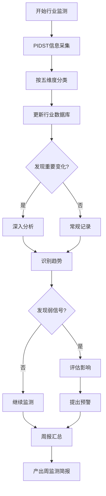

[根目录](../CLAUDE.md) > **03-行业研究库**

---

# 03-行业研究库 - 模块文档

> 最后更新：2025-12-03 17:32:18

---

## 变更记录 (Changelog)

### 2025-12-03
- 初始化模块文档
- 识别行业监测框架

---

## 模块职责

**03-行业研究库** 是行业动态跟踪与分析的专业库，负责：

- **行业监测**：持续跟踪医疗健康、人才教育等重点行业
- **周报生成**：定期产出行业监测周报
- **趋势分析**：识别行业发展趋势与弱信号
- **数据积累**：建立行业数据与案例库
- **竞争分析**：跟踪行业竞争格局变化

**设计理念**：持续监测、结构化分析、趋势洞察

---

## 入口与启动

### 行业监测流程

1. **使用行业追踪模板**
   ```
   文件：xx行业追踪.md
   ```

2. **按五维度更新**
   - 供给结构更新
   - 需求变化更新
   - 技术趋势更新
   - 竞争格局更新
   - 政策环境更新

3. **识别弱信号**
   - 记录异常现象
   - 评估潜在影响
   - 提出预警建议

---

## 对外接口

### 输入接口

| 来源 | 内容类型 | 处理方式 |
|------|---------|---------|
| 00-每日工作区 | PIDST五维信息 | 按行业分类归档 |
| 外部信息源 | 行业报告、政策文件 | 提取关键信息 |
| 数据平台 | 统计数据、市场数据 | 数据整理与分析 |
| 企业动态 | 公司公告、财报 | 竞争分析 |

### 输出接口

| 目标 | 输出物 | 频率 |
|------|-------|------|
| 领导/客户 | 行业周监测简报 | 每周 |
| 内部知识库 | 行业数据库 | 持续更新 |
| 专题研究 | 行业背景资料 | 按需提供 |
| 决策支持 | 趋势判断与预警 | 实时 |

---

## 关键依赖与配置

### 监测框架

**五维分析框架：**

1. **供给结构**
   - 产业链上下游
   - 主要参与者
   - 产能与产量
   - 技术水平

2. **需求变化**
   - 市场规模
   - 用户需求
   - 消费趋势
   - 区域分布

3. **技术趋势**
   - 技术创新
   - 应用场景
   - 成熟度评估
   - 未来方向

4. **竞争格局**
   - 市场份额
   - 竞争态势
   - 并购重组
   - 新进入者

5. **政策环境**
   - 产业政策
   - 监管变化
   - 扶持措施
   - 限制条件

### PIDST 映射

| PIDST维度 | 行业分析维度 | 说明 |
|-----------|-------------|------|
| Policy | 政策环境 | 直接映射 |
| Industry | 供给结构 + 竞争格局 | 产业层面 |
| Data | 需求变化 | 数据支撑 |
| Signals | 弱信号 | 早期预警 |
| Technology | 技术趋势 | 技术驱动 |

---

## 数据模型

### 行业周监测简报结构

```markdown
# [行业]周监测简报 - [日期]

## 1. 本周三个核心结论
1) [结论1]
2) [结论2]
3) [结论3]

## 2. 供给结构更新
- [供给侧变化]

## 3. 需求变化更新
- [需求侧变化]

## 4. 技术趋势更新
- [技术进展]

## 5. 竞争格局更新
- [竞争态势]

## 6. 政策环境更新
- [政策动态]

## 7. Weak Signals（弱信号）
- [异常现象与早期信号]

## 8. 不确定性与风险
- [风险提示]
```

### 行业数据库结构

```markdown
# [行业名称]数据库

## 基本信息
- 行业定义：
- 监测范围：
- 更新频率：

## 关键指标
- 市场规模：
- 增长率：
- 主要企业：
- 技术水平：

## 政策清单
- [政策1]：[时间] [要点]
- [政策2]：[时间] [要点]

## 企业清单
- [企业1]：[基本信息] [动态]
- [企业2]：[基本信息] [动态]

## 案例库
- [案例1]：[描述]
- [案例2]：[描述]

## 数据来源
- [来源1]
- [来源2]
```

---

## 测试与质量

### 监测质量标准

**信息覆盖度**
- [ ] 五维度是否全覆盖
- [ ] 关键企业是否跟踪
- [ ] 重要政策是否收录
- [ ] 数据是否及时更新

**分析深度**
- [ ] 是否识别趋势
- [ ] 是否发现弱信号
- [ ] 是否评估影响
- [ ] 是否提出预警

**输出质量**
- [ ] 结论是否明确
- [ ] 逻辑是否清晰
- [ ] 证据是否充分
- [ ] 建议是否可行

---

## 常见问题 (FAQ)

### Q1: 如何开始监测一个新行业？
**A:**
1. 定义行业范围与边界
2. 识别关键企业与机构
3. 建立信息源清单
4. 创建行业数据库文件
5. 设定监测频率与指标

### Q2: 如何识别弱信号？
**A:**
- 关注异常数据（突然增长或下降）
- 注意边缘创新（小公司、新技术）
- 监测政策风向（征求意见稿、试点）
- 跟踪专家观点（学术、行业领袖）
- 观察跨界动态（其他行业的影响）

### Q3: 周报写不出核心结论怎么办？
**A:**
1. 回顾本周收集的所有信息
2. 识别最重要的3个变化
3. 思考这些变化的意义
4. 提炼为简洁的结论
5. 确保结论有证据支撑

### Q4: 如何平衡监测的广度与深度？
**A:**
- 广度：确保五维度全覆盖，不遗漏重要信息
- 深度：对关键变化进行深入分析
- 策略：日常保持广度，发现重要信号时深入挖掘

### Q5: 如何提升行业监测的价值？
**A:**
1. 不只是信息汇总，要有分析和洞察
2. 识别趋势，提供前瞻性判断
3. 发现弱信号，提供早期预警
4. 建立数据库，支持决策查询
5. 定期复盘，优化监测方法

---

## 相关文件清单

### 核心文件

```
03-行业研究库/
├── CLAUDE.md                    # 本文档
├── xx行业追踪.md                # 行业监测模板
└── [具体行业文件夹]/           # 各行业数据库
    ├── 医疗健康.md
    ├── 人才教育.md
    └── 数据与案例/
```

### 依赖文档

- `../00-每日工作区/03-三行摘要收集.md` - 信息来源
- `../智库研究员工作流程指南.md` - 工作流程
- `../04-专题研究库/` - 深度研究支持

---

## 工作流程图



---

## 最佳实践

### 每日监测流程（30-45分钟）

1. **信息采集**（20分钟）
   - 浏览关键信息源
   - 按PIDST框架收集
   - 执行三行摘要

2. **分类归档**（10分钟）
   - 按行业分类
   - 按五维度归档
   - 标记重要程度

3. **趋势识别**（10分钟）
   - 对比历史数据
   - 识别异常变化
   - 记录弱信号

4. **数据库更新**（5分钟）
   - 更新关键指标
   - 补充案例库
   - 维护企业清单

### 周报生成流程（60-90分钟）

1. **回顾本周信息**（20分钟）
   - 浏览本周所有记录
   - 识别重要变化
   - 整理关键数据

2. **提炼核心结论**（20分钟）
   - 确定3个核心结论
   - 构建证据链
   - 评估影响

3. **撰写周报**（30分钟）
   - 按模板填写
   - 补充分析
   - 添加图表

4. **质量检查**（10分钟）
   - 检查逻辑
   - 验证数据
   - 优化表达

---

## 性能指标

### 监测覆盖度

| 维度 | 目标 | 说明 |
|------|------|------|
| 行业数量 | 2-3个 | 医疗健康、人才教育为主 |
| 信息源数量 | 10-15个/行业 | 官方、行业、媒体、学术 |
| 更新频率 | 每日 | 工作日每日更新 |
| 周报产出 | 每周 | 周五产出 |

### 质量指标

- **信息时效性**：24小时内
- **分析深度**：每周至少3个深度分析
- **弱信号识别**：每月至少2个
- **预警准确率**：>70%

---

## 优化建议

1. **建立行业数据库**：为医疗健康、人才教育创建独立数据库文件
2. **完善信息源清单**：整理各行业的关键信息源
3. **开发监测工具**：使用脚本自动采集部分数据
4. **建立指标体系**：定义各行业的关键监测指标
5. **案例库建设**：系统收集典型案例，便于引用

---

*本文档遵循自适应架构师规范，提供模块级详细说明*
