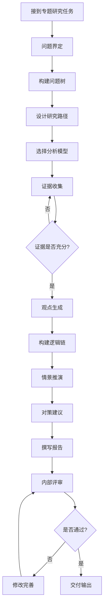

[根目录](../CLAUDE.md) > **04-专题研究库**

---

# 04-专题研究库 - 模块文档

> 最后更新：2025-12-03 17:32:18

---

## 变更记录 (Changelog)

### 2025-12-03
- 初始化模块文档
- 识别专题研究模板与方法论

---

## 模块职责

**04-专题研究库** 是智库深度研究的核心工作区，负责：

- **专题研究管理**：组织和推进长期专题研究项目
- **方法论沉淀**：提供标准化的研究框架和模板
- **证据链构建**：系统化收集和组织研究证据
- **观点生成**：基于证据链产出有价值的洞察
- **对策建议**：提出可执行的政策或行动建议

**设计理念**：结构化研究、证据驱动、小颗粒度推进

---

## 入口与启动

### 启动新专题研究

1. **使用专题研究模板**
   ```
   文件：专题研究模板.md
   ```

2. **定义研究问题**
   - 构建问题树（总问题 → 子问题）
   - 明确研究边界与范围
   - 设定研究目标与交付物

3. **设计研究路径**
   - 选择适用的分析模型
   - 规划证据收集方向
   - 制定研究时间表

---

## 对外接口

### 输入接口

| 来源 | 内容类型 | 用途 |
|------|---------|------|
| 00-每日工作区 | 三行摘要、证据链 | 补充研究素材 |
| 03-行业研究库 | 行业数据、趋势分析 | 提供背景信息 |
| 外部资源 | 政策文件、学术论文、案例 | 构建证据链 |
| 领导需求 | 研究方向、关注重点 | 指导研究方向 |

### 输出接口

| 目标 | 输出物 | 格式 |
|------|-------|------|
| 领导/客户 | 专题研究报告 | 完整报告（Word/PDF） |
| 内部分享 | 研究简报 | 一页纸/PPT |
| 知识库 | 方法论、模型 | Markdown |
| 决策支持 | 对策建议 | 结构化文档 |

---

## 关键依赖与配置

### 核心方法论

1. **问题树分析法**
   ```
   主问题：[核心研究问题]
   ├── 子问题1：[分解问题]
   │   ├── 子问题1.1
   │   └── 子问题1.2
   ├── 子问题2：[分解问题]
   └── 子问题3：[分解问题]
   ```

2. **证据链构建**
   - **事实（F）**：客观发生的事件
   - **数据（D）**：量化指标和统计数据
   - **政策（P）**：相关政策文件和导向
   - **趋势（T）**：行业和市场趋势
   - **弱信号（S）**：早期预警信号

3. **常用分析模型**
   - SWOT 分析
   - PEST 分析
   - 波特五力模型
   - SCP 范式（结构-行为-绩效）
   - 情景推演
   - 政策分析框架

### 依赖文档

- `专题研究模板.md` - 标准研究框架
- `../智库研究员工作流程指南.md` - 工作流程参考
- `../00-每日工作区/` - 日常素材来源

---

## 数据模型

### 专题研究标准结构

```markdown
# [专题名称]

## 1. 课题界定（问题树）
- 总问题：[核心研究问题]
- 子问题：
  - 子问题1
  - 子问题2
  - 子问题3

## 2. 研究路径设计（选用哪些模型）
- 模型1：[如 SWOT 分析]
- 模型2：[如政策分析框架]
- 模型3：[如情景推演]

## 3. 证据链（数据、政策、观点、案例）
- 数据：
  - [数据来源1]
  - [数据来源2]
- 政策：
  - [政策文件1]
  - [政策文件2]
- 案例：
  - [案例1]
  - [案例2]
- 专家观点：
  - [观点1]
  - [观点2]

## 4. 观点生成（洞察）
- 洞察1：[核心观点]
  - 依据：[证据支撑]
  - 逻辑链：[推理过程]
- 洞察2：[核心观点]
- 洞察3：[核心观点]

## 5. 情景推演
- 基准情景：[当前状态延续]
- 乐观情景：[最好情况]
- 悲观情景：[最坏情况]
- 可能性分析：[各情景概率]

## 6. 对策建议（可执行）
- 建议1：[具体建议]
  - 实施主体：[谁来做]
  - 实施路径：[怎么做]
  - 预期效果：[达成什么]
- 建议2：[具体建议]
- 建议3：[具体建议]

## 7. 附录/材料
- 参考文献
- 数据表格
- 补充材料
```

---

## 测试与质量

### 研究质量标准

**问题界定质量**
- [ ] 问题是否清晰明确
- [ ] 问题树是否完整（MECE原则）
- [ ] 研究边界是否清晰

**证据链质量**
- [ ] 证据来源是否可靠
- [ ] 证据是否充分（数量与质量）
- [ ] 证据是否支撑观点

**观点质量**
- [ ] 观点是否有新意
- [ ] 逻辑链是否清晰
- [ ] 是否具有前瞻性

**建议质量**
- [ ] 建议是否可执行
- [ ] 建议是否具体
- [ ] 建议是否有针对性

### 研究进度检查

| 阶段 | 检查点 | 标准 |
|------|--------|------|
| 问题界定 | 问题树完成 | 子问题不超过5个，层级不超过3层 |
| 证据收集 | 证据链完整 | 每个子问题至少3条证据 |
| 观点生成 | 洞察产出 | 至少3个核心洞察 |
| 对策建议 | 建议可行性 | 每条建议包含实施主体、路径、效果 |

---

## 常见问题 (FAQ)

### Q1: 如何开始一个新的专题研究？
**A:**
1. 复制 `专题研究模板.md` 创建新文件
2. 先完成问题界定，构建问题树
3. 在 `00-每日工作区/02-当前专题项目.md` 中登记项目
4. 采用小颗粒度推进，每日完成一个小节

### Q2: 如何构建有效的问题树？
**A:**
- 使用 MECE 原则（相互独立，完全穷尽）
- 子问题不超过 5 个，避免过度复杂
- 每个子问题都应该是可研究、可回答的
- 使用"如何"、"为什么"、"是什么"等疑问词

### Q3: 证据链不够充分怎么办？
**A:**
1. 回到 PIDST 五维框架，系统性补充
2. 扩大信息源范围（学术、行业、政府、媒体）
3. 使用 AI 辅助搜索相关资料
4. 考虑进行专家访谈或调研

### Q4: 如何避免专题研究拖延？
**A:**
- 采用小颗粒度推进，每日只完成一个小节
- 设定明确的里程碑和截止日期
- 每周回顾进度，及时调整
- 避免追求完美，先完成再优化

### Q5: 如何提升观点的质量？
**A:**
1. 确保每个观点都有充分的证据支撑
2. 使用"依据 → 逻辑链 → 结论"的结构
3. 多角度验证观点的合理性
4. 与同事或 AI 讨论，获取反馈

---

## 相关文件清单

### 核心文件

```
04-专题研究库/
├── CLAUDE.md                    # 本文档
├── 专题研究模板.md              # 标准研究框架
└── [具体专题文件夹]/           # 各专题研究内容
    ├── 研究报告.md
    ├── 证据材料/
    └── 附件/
```

### 参考文档

- `../智库研究员工作流程指南.md` - 专题研究推进方法
- `../00-每日工作区/02-当前专题项目.md` - 项目跟踪
- `../03-行业研究库/` - 行业背景信息

---

## 工作流程图



---

## 最佳实践

### 小颗粒度推进策略

**每日推进选项（选择其一）：**
- [ ] 补充证据链（2-4条新证据）
- [ ] 完成问题界定（1个子问题）
- [ ] 完成一个案例分析
- [ ] 完成一个趋势分析
- [ ] 完成一个对策建议小节

**推进模板：**
```markdown
【今日推进内容 - YYYY-MM-DD】
- 模型：使用了 XXX 框架
- 新增证据链：
  - 证据1
  - 证据2
- 新增观点：
  - 观点1
- 对应章节：[章节名称]
- 下一步：[明日计划]
```

### AI 辅助技巧

1. **问题树构建**
   - 提示词："帮我构建关于[主题]的问题树，使用MECE原则"

2. **证据搜索**
   - 提示词："搜索关于[子问题]的政策文件、数据和案例"

3. **观点提炼**
   - 提示词："基于以下证据，提炼3个核心洞察：[证据列表]"

4. **对策建议**
   - 提示词："针对[问题]，提出可执行的对策建议，包含实施主体、路径和效果"

---

## 性能指标

### 时间分配建议

| 阶段 | 时间占比 | 说明 |
|------|---------|------|
| 问题界定 | 10% | 磨刀不误砍柴工 |
| 证据收集 | 30% | 最耗时但最重要 |
| 观点生成 | 20% | 核心价值所在 |
| 情景推演 | 15% | 增强前瞻性 |
| 对策建议 | 15% | 确保可执行性 |
| 报告撰写 | 10% | 结构化表达 |

### 产出指标

- **研究周期**：2-4周（根据复杂度）
- **证据数量**：每个子问题至少3条
- **核心洞察**：至少3个
- **对策建议**：至少3条
- **报告篇幅**：5000-10000字

---

## 优化建议

1. **建立案例库**：收集典型案例，便于快速引用
2. **模型库扩充**：整理常用分析模型，形成工具箱
3. **模板细化**：针对不同类型专题（政策分析、行业研究、技术评估）创建专用模板
4. **协作机制**：建立专题研究的内部评审机制
5. **知识复用**：将完成的专题研究中的方法论沉淀为可复用资产

---

*本文档遵循自适应架构师规范，提供模块级详细说明*
