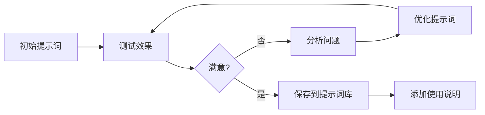

[根目录](../CLAUDE.md) > **05-AI技术文档**

---

# 05-AI技术文档 - 模块文档

> 最后更新：2025-12-03 17:32:18

---

## 变更记录 (Changelog)

### 2025-12-03
- 初始化模块文档
- 识别技术文档与提示词库

---

## 模块职责

**05-AI技术文档** 是 AI 技术积累与应用的知识中心，负责：

- **技术文档沉淀**：记录 AI 工具使用心得与最佳实践
- **提示词库管理**：收集和整理各类场景的提示词模板
- **技术方案设计**：存储技术系统设计文档
- **能力提升**：支持研究员的 AI 技术能力成长
- **工具评估**：记录各类 AI 工具的评测与对比

**设计理念**：实践驱动、持续积累、快速复用

---

## 入口与启动

### 模块结构

```
05-AI技术文档/
├── CLAUDE.md                           # 本文档
├── 技术文档/
│   └── Claude Code使用心得与思考.md    # Claude Code 深度使用指南
└── 提示词收集库/
    ├── 1.md                            # 提示词示例
    ├── aigc.md                         # AIGC 相关提示词
    ├── ppt.md                          # PPT 生成提示词
    ├── 通用移动端ui提示词.md           # UI 设计提示词
    └── Gemini-3提示词工程指南 附元提示词.md
```

---

## 对外接口

### 输入接口

| 来源 | 内容类型 | 用途 |
|------|---------|------|
| 日常实践 | AI 工具使用经验 | 技术文档积累 |
| 外部资源 | 提示词模板、技术文章 | 知识库扩充 |
| 项目实践 | 技术方案、系统设计 | 方案沉淀 |
| 学习研究 | AI 技术趋势、新工具 | 技术跟踪 |

### 输出接口

| 目标 | 输出物 | 价值 |
|------|-------|------|
| 日常工作 | 提示词模板 | 提升工作效率 |
| 团队分享 | 技术文档 | 知识传播 |
| 项目开发 | 技术方案 | 指导实施 |
| 能力提升 | 最佳实践 | 技能成长 |

---

## 关键依赖与配置

### 核心技术栈

1. **Claude Code**
   - 用途：代码辅助、文档生成、工作流自动化
   - 参考：`技术文档/Claude Code使用心得与思考.md`

2. **提示词工程**
   - 结构化提示词设计
   - 场景化模板库
   - 元提示词应用

3. **AI 辅助工作流**
   - 自动摘要生成
   - 信息清洗脚本
   - 文本分析与情感分析
   - 问题树构建

### 工具配置

- **本地模型**：用于离线处理和隐私保护
- **API 服务**：Claude、GPT、Gemini 等
- **辅助工具**：Python 脚本、自动化工具

---

## 数据模型

### 技术文档结构

```markdown
# [技术主题]

## 前言
[背景与动机]

## 核心概念
[关键概念解释]

## 使用场景
[适用场景列表]

## 最佳实践
[实践经验总结]

## 常见问题
[FAQ]

## 案例分析
[具体案例]

## 总结与展望
[总结与未来方向]
```

### 提示词模板结构

```markdown
# [提示词用途]

## 场景描述
[使用场景说明]

## 提示词模板
```
[具体提示词内容]
```

## 参数说明
- 参数1：[说明]
- 参数2：[说明]

## 使用示例
[实际使用案例]

## 优化建议
[改进方向]
```

---

## 测试与质量

### 提示词质量标准

- [ ] 场景描述清晰
- [ ] 提示词结构完整
- [ ] 参数说明详细
- [ ] 有实际使用示例
- [ ] 可复用性强

### 技术文档质量标准

- [ ] 内容准确性
- [ ] 实践可操作性
- [ ] 案例丰富性
- [ ] 更新及时性
- [ ] 结构清晰性

---

## 常见问题 (FAQ)

### Q1: 如何快速找到合适的提示词？
**A:**
1. 按场景分类浏览提示词库
2. 使用关键词搜索
3. 参考类似场景的提示词进行改编

### Q2: 如何编写高质量的提示词？
**A:**
- 明确任务目标和期望输出
- 提供充分的上下文信息
- 使用结构化的格式
- 包含具体的示例
- 迭代优化直到满意

### Q3: Claude Code 的核心优势是什么？
**A:** 参考 `技术文档/Claude Code使用心得与思考.md`，核心优势包括：
- 全局项目理解能力
- 小步迭代的工作方式
- Plan Mode 的规划能力
- Subagent 的上下文扩展
- 命令和 Hooks 的自动化

### Q4: 如何在智库工作中应用 AI？
**A:**
- 信息摘要与提炼
- 结构化分析辅助
- 文档自动生成
- 数据处理与清洗
- 知识管理与检索

### Q5: 如何持续提升 AI 使用能力？
**A:**
1. 每日做一件 AI 能力强化动作
2. 记录使用心得和最佳实践
3. 关注 AI 技术发展趋势
4. 参与社区交流与分享
5. 在实际项目中不断实践

---

## 相关文件清单

### 核心文档

```
05-AI技术文档/
├── CLAUDE.md                                      # 本文档
├── 技术文档/
│   └── Claude Code使用心得与思考.md               # 深度使用指南
└── 提示词收集库/
    ├── 1.md                                       # 提示词示例
    ├── aigc.md                                    # AIGC 提示词
    ├── ppt.md                                     # PPT 生成
    ├── 通用移动端ui提示词.md                      # UI 设计
    └── Gemini-3提示词工程指南 附元提示词.md       # 提示词工程
```

---

## 核心洞察摘要

### Claude Code 使用心得（精华提炼）

**1. Vibe Coding 的本质**
- 不仅是编程方式的改变，更是思维模式的转变
- 迭代速度的提升带来竞争格局的改变
- 需要平衡效率与思考时间

**2. 与传统编辑器 AI 的差异**
- 全局视野 vs 局部修改
- 命令行的"强迫"依赖反而提升效能
- 减少人类干预，让 AI 发挥最大潜力

**3. 使用边界与长处**
- 擅长：算法实现、框架搭建、代码分析、架构设计
- 不擅长：精确重构、100%准确性任务
- 训练数据偏差影响不同技术栈的表现

**4. 工作方式选择**
- Plan Mode：适合有经验的开发者和既有项目
- 直接实践：适合探索性项目和快速验证
- 小步迭代 > 一步到位

**5. 上下文管理**
- 200k 窗口是稀缺资源
- 任务拆解是关键
- 善用 Subagent 扩展能力
- 主动 compact 优于被动压缩

**6. 周边工具**
- Command 和 Hooks 提升效率
- MCP 补充模型知识盲区
- 测试驱动保证质量
- 语音输入革命性提升体验

**7. 超越代码的应用**
- 代码提交和 PR 管理
- 技术文档撰写
- 项目管理集成
- 数据处理自动化

---

## 最佳实践

### 每日 AI 增强动作（10-15分钟）

- [ ] 用本地模型做自动摘要
- [ ] 用 Python 写信息清洗脚本
- [ ] 用 AI 对比政策条款
- [ ] 用 Agent 辅助构建问题树
- [ ] 用 AI 进行文本分析

### 提示词优化流程



### AI 工具选择矩阵

| 任务类型 | 推荐工具 | 理由 |
|---------|---------|------|
| 代码开发 | Claude Code | 全局理解、小步迭代 |
| 文档撰写 | Claude/GPT | 长文本生成能力强 |
| 数据分析 | Python + AI | 精确性与灵活性 |
| 信息摘要 | 本地模型 | 隐私保护、成本低 |
| 创意生成 | GPT/Gemini | 发散思维能力强 |

---

## 技术趋势跟踪

### 当前关注领域

1. **大模型发展**
   - Claude Sonnet 4.5 vs Opus
   - 上下文窗口扩展（200k → 1M）
   - 推理能力提升

2. **工具生态**
   - MCP（Model Context Protocol）
   - Subagent 架构
   - 命令行 AI 工具

3. **应用场景**
   - 知识管理自动化
   - 研究辅助系统
   - 智能工作流

### 未来展望

- 更长的上下文窗口
- 更强的推理能力
- 更好的多模态支持
- 更低的使用成本
- 更完善的工具生态

---

## 优化建议

1. **提示词库扩充**
   - 按场景分类（信息采集、分析、输出、管理）
   - 添加更多实际使用案例
   - 建立提示词评分机制

2. **技术文档完善**
   - 补充更多 AI 工具的使用指南
   - 记录实际项目中的应用案例
   - 建立技术问题解决方案库

3. **自动化工具开发**
   - 开发信息采集自动化脚本
   - 建立三行摘要生成工具
   - 创建知识库索引系统

4. **能力提升计划**
   - 定期学习新的 AI 技术
   - 参与 AI 社区交流
   - 实践新工具和方法
   - 分享经验与心得

---

*本文档遵循自适应架构师规范，提供模块级详细说明*
