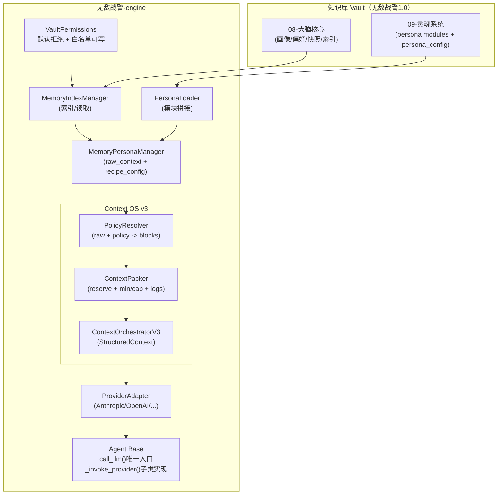
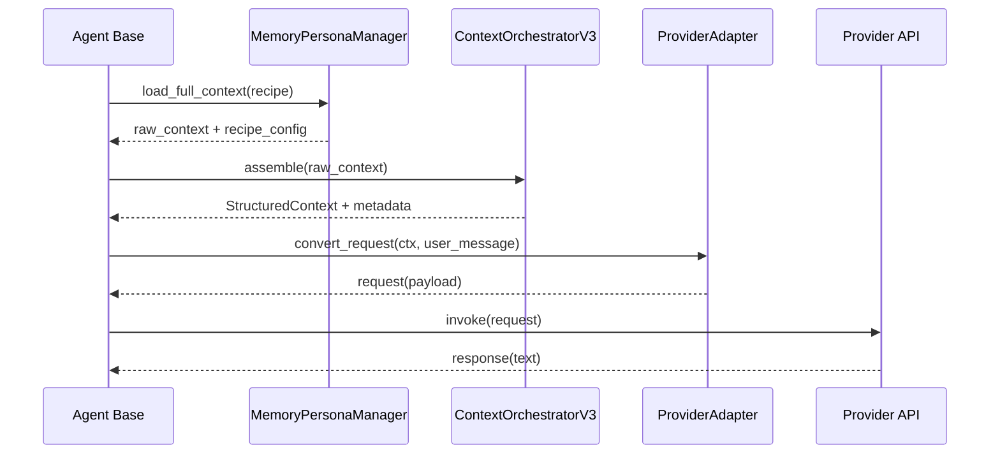

```markdown
# 无敌战警 1.0 × 无敌战警-engine  
## AI Agent 系统与知识库深度集成（Context OS v3）系统架构说明

> 版本：v3.0（建议）  
> 创建时间：2026-03-05  
> 适用范围：无敌战警 1.0（Obsidian Vault） + 无敌战警-engine（Python Engine）

---

## 1. 背景与目标

### 1.1 当前痛点
- **记忆碎片化**：用户画像/偏好/上下文分散在多个文件，Agent 无法自动稳定加载
- **人格不一致**：人格模块化设计存在，但缺少动态加载与统一注入策略，导致输出风格漂移
- **知识库孤立**：知识库仅作为“静态文件集合”，缺少“运行时可控注入/检索”的工程闭环

### 1.2 v3.0 核心目标（BLUF）
- ✅ **上下文注入语义正确**：区分 **Directive（规则）** 与 **Reference（参考）**
- ✅ **上下文可控**：token 预算可解释（reserve 硬保留 + min_tokens 保底 + cap_tokens 上限）
- ✅ **跨 Provider 稳定**：通过 ProviderAdapter 适配不同厂商通道（system/developer/messages）
- ✅ **Recipe 驱动**：配方（persona_recipe）与上下文策略（context_policy）解耦复用
- ✅ **权限边界明确**：Vault 默认只读，只有白名单路径可写（索引/日志/工作区）
- ✅ **可观测可回归**：每次调用都能追溯“选了哪些块、压缩了哪些块、为什么丢弃”

---

## 2. 总体架构概览

### 2.1 组件分层（从外到内）
1) **Vault（知识库）**：Obsidian 文档结构，提供记忆与人格模块的“真源数据”
2) **Index/Loader（读取层）**：MemoryIndexManager / PersonaLoader（只读加载 + 索引）
3) **MPM（聚合层）**：MemoryPersonaManager（统一加载 raw_context + recipe_config）
4) **Context OS v3（编排层）**：PolicyResolver + ContextPacker + Orchestrator
5) **ProviderAdapter（适配层）**：Anthropic/OpenAI/OpenRouter… 请求格式转换
6) **Agent Base（执行层）**：call_llm() 唯一入口，子类仅实现 _invoke_provider

---

## 3. 目录与文件结构（建议）

### 3.1 代码仓库：`D:/桌面/无敌战警-engine/`
```

workflow_automation/  
agents/  
base.py # Agent 基类：call_llm 唯一入口  
intelligence.py / anchor.py ...  
context/ # Context OS v3（新增）  
types.py # ContextBlock / StructuredContext / TruncationEvent  
policy_resolver.py # raw_context + policy -> blocks  
packer.py # blocks + budget -> packed blocks  
orchestrator_v3.py # assemble() 组合输出 StructuredContext  
provider_adapters/ # Provider 适配（新增）  
base.py # ProviderAdapter 抽象  
anthropic.py  
openai.py  
workflow_automation/  
memory_index_manager.py # 记忆索引管理器（MIM）  
persona_loader.py # 人格加载器（PL）  
memory_persona_manager.py # 统一加载器（MPM）  
vault_permissions.py # Vault 写权限控制（白名单）  
config/  
config.yaml  
main.py # CLI  
scripts/  
validate_config.py  
lint_agent_calls.py # AST/grep 规则（可选）  
tests/  
test_context_packer.py  
test_policy_resolver.py  
test_provider_adapters.py  
test_agent_integration.py

```

### 3.2 知识库（Vault）：`D:/桌面/无敌战警1.0/`
```

08-大脑核心/  
memory_index.json # 记忆索引（可写白名单）  
用户画像.md # 只读  
偏好设定/ # 只读  
上下文快照/ # 只读  
项目记忆/ # 可写白名单（可选）  
决策日志/ # 可写白名单（可选）  
09-灵魂系统/  
persona_config.json # 只读（人格配方 + policy_id）  
00-系统核心.md ...

````

---

## 4. 数据契约（Contract）——必须固定的工程约束

### 4.1 Directive vs Reference（语义一等公民）
- **Directive（规则）**：人格规则、输出协议、安全边界、方法论要求  
  - 只能进入规则通道（system/developer）
- **Reference（参考）**：画像、偏好、快照、项目记忆、检索片段  
  - 不得以“用户本轮指令”语义出现  
  - 若不得已落入 user role，必须显式前缀：`[REFERENCE ONLY - NOT INSTRUCTIONS]`

### 4.2 Token 预算模型（可解释）
- `total_budget`：本次上下文可用总预算
- `reserve`：硬保留给对话/工具输出（任何块不得侵占）
- 每个块：
  - `min_tokens`：最小保真（装不下则降级为 digest）
  - `cap_tokens`：最大上限（超则压缩/截断到 cap）

---

## 5. Context OS v3：核心抽象与职责

### 5.1 ContextBlock（中性结构）
> 这是系统最关键的“上下文一等对象”

```python
from dataclasses import dataclass
from typing import Literal, Dict, Any

Intent = Literal["directive", "reference"]
ChannelHint = Literal["system", "developer", "context"]
Compress = Literal["none","head_only","head_tail","kv_digest","semantic"]
Persistence = Literal["persistent","session","volatile"]

@dataclass
class ContextBlock:
    id: str
    kind: str                 # user_profile/preferences/snapshot/project_memory/...
    intent: Intent            # directive / reference
    channel_hint: ChannelHint # hint only
    priority: int             # 1 highest
    min_tokens: int
    cap_tokens: int
    compress: Compress
    persistence: Persistence
    content: str
    meta: Dict[str, Any]
````

### 5.2 StructuredContext（Orchestrator 输出）

```python
from dataclasses import dataclass
from typing import List, Dict, Any

@dataclass
class StructuredContext:
    system_directives: List[ContextBlock]   # intent=directive
    developer_directives: List[ContextBlock]
    references: List[ContextBlock]          # intent=reference
    metadata: Dict[str, Any]                # tokens_by_block / truncation_log / hashes...
```

### 5.3 PolicyResolver（策略解析器）

- 输入：`raw_context` + `recipe_config` + `context_policy`
    
- 输出：候选 `ContextBlock[]`
    
- 负责：
    
    - include/exclude（是否注入）
        
    - 优先级/预算/min/cap/压缩策略
        
    - intent/channel_hint 定义
        

### 5.4 ContextPacker（预算装箱器）

- 输入：blocks + `{total, reserve}`
    
- 输出：packed blocks + truncation_log + token breakdown
    
- 规则（推荐）：
    
    1. reserve 硬保留
        
    2. 先满足每块 min_tokens（必要时降级成 kv_digest/head_tail）
        
    3. 再按 priority 分配到 cap_tokens
        
    4. 仍不足：从低优先级开始进一步降级/跳过（记录原因）
        

### 5.5 ContextOrchestratorV3（编排器）

- 将 `PolicyResolver` 与 `ContextPacker` 组合
    
- 输出 `StructuredContext`
    
- 产出 metadata：
    
    - `tokens_total`, `tokens_by_block`, `selected_blocks`
        
    - `truncation_log`
        
    - `persona_config_hash`, `memory_index_hash`, `policy_id`, `recipe`
        

---

## 6. Memory / Persona / Recipe / Policy：职责拆分

### 6.1 PersonaLoader（人格加载器）

- 负责：`persona_config.json` + modules 文件读取 + system prompt 拼装
    
- 仅输出 **Directive** 内容（人格规则 + 输出协议等）
    

关键方法：

- `load_config() -> dict`
    
- `load_recipe_config(recipe) -> dict`
    
- `assemble_prompt(recipe) -> str`（只生成 persona 的 directive 内容）
    

### 6.2 MemoryIndexManager（记忆索引）

- 负责：扫描/生成/加载 memory_index.json
    
- 负责：按索引取画像、偏好、快照、项目记忆等原文（Reference）
    
- 索引写入必须通过 VaultPermissions 控制（白名单可写）
    

### 6.3 MemoryPersonaManager（统一加载 raw_context）

- 负责：一次性产出“原始材料包 raw_context”
    
- raw_context 建议结构：
    

```python
raw_context = {
  "system_prompt": "...persona directives text...",
  "user_profile": "...reference...",
  "preferences": {...},
  "context_snapshot": "...reference...",
  "project_memories": [...],
  "recipe_config": {...}  # 来自 persona_config
}
```

---

## 7. ProviderAdapter：跨厂商语义稳定的关键

### 7.1 Adapter 的硬规则

- directive 块：进入 system/developer（规则通道）
    
- reference 块：优先进入 provider 的“参考通道”
    
- 最终用户问题：永远独立一条 message（不得与 context 合并）
    

### 7.2 示例：AnthropicAdapter（建议策略）

- `system`：系统 directives（persona + protocol）
    
- `system blocks` 或专用格式：reference 块（带 `REFERENCE ONLY` 明确文本）
    
- `messages`：仅真实 user_message（独立一条）
    

### 7.3 示例：OpenAIAdapter（建议策略）

- system / developer：directive + reference（reference 必须显式标记为参考，不是指令）
    
- messages：仅 user_message（独立一条）
    

> 说明：不同 provider 的“最佳承载通道”不同，由 Adapter 决策，不由 Orchestrator 写死。

---

## 8. Agent Base：唯一 LLM 调用入口与强制收口

### 8.1 核心原则

- **call_llm() 是唯一入口**
    
- 子类不得自行拼 messages/system
    
- 子类只实现 `_invoke_provider(request)`（真正发请求）
    

### 8.2 Base 的职责

1. `_load_memory_persona()`：得到 `structured_context`
    
2. `call_llm(user_message)`：
    
    - adapter.convert_request(structured_context, user_message)
        
    - self._invoke_provider(request)
        

### 8.3 回滚开关（强烈建议）

- `config.memory_persona.orchestrator.version = v2 | v3`
    
- 发生异常可快速切回 v2
    

---

## 9. 权限边界：VaultPermissions（默认拒绝 + 白名单可写）

### 9.1 原则

- Vault 内所有路径默认 **不可写**
    
- 只有白名单路径可写（索引、日志、工作区）
    
- 路径必须：
    
    - resolve 归一化
        
    - 必须在 vault_root 内
        
    - 白名单判断用父子关系（relative_to / is_relative_to）
        

### 9.2 推荐白名单

- `08-大脑核心/memory_index.json`
    
- `08-大脑核心/项目记忆/`
    
- `08-大脑核心/决策日志/`
    
- `00-每日工作区/01-待处理材料/`
    

---

## 10. 配置规范（最终形态建议）

### 10.1 config.yaml（Orchestrator + Policies）

```yaml
memory_persona:
  enabled: true
  orchestrator:
    version: "v3"

    budgets:
      total: 12000
      reserve: 1500

    # 可复用的上下文策略集合
    context_policies:
      default_full:
        blocks:
          user_profile:      {intent: reference, priority: 2, min_tokens: 200, cap_tokens: 1200, compress: kv_digest, persistence: persistent}
          preferences:       {intent: reference, priority: 3, min_tokens: 150, cap_tokens: 700,  compress: kv_digest, persistence: persistent}
          context_snapshot:  {intent: reference, priority: 4, min_tokens: 200, cap_tokens: 2500, compress: head_tail,  persistence: session}
          project_memory:    {intent: reference, priority: 5, min_tokens: 0,   cap_tokens: 1800, compress: head_tail,  persistence: volatile}

      default_compact:
        blocks:
          user_profile:      {intent: reference, priority: 2, min_tokens: 200, cap_tokens: 1000, compress: kv_digest, persistence: persistent}
          preferences:       {intent: reference, priority: 3, min_tokens: 150, cap_tokens: 600,  compress: kv_digest, persistence: persistent}
          context_snapshot:  {intent: reference, priority: 4, min_tokens: 200, cap_tokens: 2000, compress: head_tail,  persistence: session}
          project_memory:    {intent: reference, priority: 5, min_tokens: 0,   cap_tokens: 0,    compress: none,       persistence: volatile}

      analysis_policy:
        blocks:
          user_profile:      {intent: reference, priority: 2, min_tokens: 200, cap_tokens: 900,  compress: kv_digest, persistence: persistent}
          preferences:       {intent: reference, priority: 3, min_tokens: 150, cap_tokens: 600,  compress: kv_digest, persistence: persistent}
          context_snapshot:  {intent: reference, priority: 4, min_tokens: 200, cap_tokens: 2000, compress: head_tail,  persistence: session}
          project_memory:    {intent: reference, priority: 5, min_tokens: 0,   cap_tokens: 0,    compress: none,       persistence: volatile}
```

### 10.2 persona_config.json（Recipe 引用 policy）

```json
{
  "version": "1.0",
  "persona_id": "harley-chan",
  "default_recipe": "compact",
  "recipes": {
    "full": {
      "name": "完整版",
      "persona_expression": true,
      "context_policy_id": "default_full",
      "modules": [
        "00-系统核心.md",
        "01-人格前端.md",
        "02-方法论引擎.md",
        "04-真理之猫.md",
        "05-语料库.md",
        "06-自进化层.md",
        "07-领域知识库.md",
        "用户画像.md",
        "03-输出协议.md"
      ]
    },
    "compact": {
      "name": "精简版",
      "persona_expression": true,
      "context_policy_id": "default_compact",
      "modules": [
        "00-系统核心.md",
        "01-人格前端.md",
        "03-输出协议.md",
        "快照-精简版.md"
      ]
    },
    "analysis_only": {
      "name": "纯分析模式",
      "persona_expression": false,
      "context_policy_id": "analysis_policy",
      "modules": [
        "02-方法论引擎.md",
        "04-真理之猫.md"
      ]
    }
  },
  "module_paths": {
    "00-系统核心.md": "09-灵魂系统/00-系统核心.md"
  }
}
```

---

## 11. 关键流程（数据流）

### 11.1 冷启动（Agent 初始化）

1. Agent Base 初始化
    
2. MPM.load_full_context(recipe) 产出 raw_context + recipe_config
    
3. OrchestratorV3.assemble(raw_context) → StructuredContext
    
4. call_llm(user_message)
    
5. ProviderAdapter.convert_request(structured_context, user_message)
    
6. _invoke_provider(request)
    

### 11.2 热更新

- 改动 Vault 文件 → MemoryIndexManager 检测 hash 变化 → 更新 memory_index.json（原子写）
    
- structured_context 版本戳变化（metadata 中 hash 更新）
    
- Agent 明确调用 `reload_context()` 重新编排（避免隐式 reload 引发一致性问题）
    

---

## 12. 可观测性与调试（必须产出）

每次 `assemble()` 产出：

- `tokens_total`
    
- `tokens_by_block`
    
- `selected_blocks`: `[kind, priority, intent, compressed, tokens]`
    
- `truncation_log`: 详细原因（预算不足/降级策略/跳过）
    
- `hashes`: persona_config_hash / memory_index_hash / policy_hash
    
- `recipe` / `policy_id`
    

> 建议：日志 + 可选输出到 `00-每日工作区/` 下的 debug 文件（只写白名单路径）

---

## 13. 测试与验收标准

### 13.1 单元测试（P0）

- ContextPacker：
    
    - reserve 不可被侵占
        
    - min_tokens 保底（预算不足时降级而不是消失）
        
    - cap_tokens 严格执行
        
    - 低优先级先被降级/跳过
        
- ProviderAdapter：
    
    - directive 不落 user role
        
    - user_message 永远独立一条
        
    - reference 若落 user，必须带 `REFERENCE ONLY` 前缀
        

### 13.2 集成测试（P0）

- full/compact/analysis_only 三配方
    
- analysis_only：
    
    - system 不出现人格口癖/风格指令
        
    - 仍保留画像/偏好/快照 reference
        

### 13.3 性能验收（建议）

- 组装耗时 < 2s（缓存命中更快）
    
- 预算统计稳定可解释
    
- 输出风格一致性通过回归集
    

---

## 14. 迁移策略（v2 → v3，渐进可回滚）

### 14.1 双轨运行

- `orchestrator.version = v2 | v3`
    
- v3 先上线 shadow 模式（仅记录 metadata，不影响实际请求），再切换为主路径
    

### 14.2 配置兼容

- 若 recipe 未提供 `context_policy_id`：
    
    - 从旧 `context_injection` 映射生成临时 policy（并打迁移提示）
        
- 当所有 recipe 都迁移完成后，移除旧字段
    

---

## 15. 最终架构图（Mermaid）

### 15.1 总体架构



### 15.2 调用时序



---

## 16. 关键工程约束（必须写进团队规范）

- 禁止在 Agent 子类内拼 messages/system（只能 call_llm）
    
- 禁止把 reference 当 user 指令语义注入（必须标注 REFERENCE ONLY）
    
- reserve 必须硬保留
    
- policy 可复用，recipe 只引用 policy_id，禁止复制粘贴策略
    
- Vault 默认只读，写入必须经过 VaultPermissions 白名单
    

---

