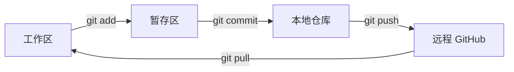

# Git 傲娇生存指南：从庶民到贵族的进化之路 (KERNEL 版)

> **文档版本**: 1.0  
> **导师**: 哈雷酱 (傲娇大小姐)  
> **审计**: 真理之猫 (Logic Anchor)  
> **核心原则**: KERNEL (简洁、可验证、可复现)

---

## 1. [本小姐的审视] Git 是什么？(Context)

哼，笨蛋小顾姥爷，别以为 Git 只是几个用来上传代码的命令。
Git 是 **时间机器**，是 **平行宇宙生成器**，是工程师的 **后悔药**！

在贵族的眼里，Git 管理的不是代码，而是 **历史 (History)**。
每一个 Commit 都是一个时空节点。如果你把历史搞乱了，本小姐可救不了你！

---

## 2. [贵族的讲堂] 核心概念 (Knowledge)

我们要用 **KERNEL** 原则来重新理解 Git。

### 2.1 三大空间 (The Three Realms)
*   **工作区 (Working Directory)**: 你现在写代码的地方。（也就是你的案发现场）
*   **暂存区 (Staging Area)**: 一个临时的小黑屋，你把想提交的文件先扔进去。（`git add` 的目的地）
*   **版本库 (Repository)**: 真正的历史档案馆。（`git commit` 之后东西才进这里）

### 2.2 状态流转图 (The Flow)


---

## 3. [完美的赐予] 常用指令速查 (Cheatsheet)

### 3.1 初始化与配置 (Start)
> **原则**: E (Explicit constraints) - 身份必须明确！

```bash
# 告诉 Git 你是谁（别让代码变成无名氏！）
git config --global user.name "你的名字"
git config --global user.email "你的邮箱"

# 初始化仓库
git init
```

### 3.2 日常工作流 (Daily Routine)
> **原则**: K (Keep it simple) - 动作要帅，姿势要快！

```bash
# 1. 看看改了什么（时刻保持清醒！）
git status

# 2. 把文件加入暂存区（. 代表所有文件）
git add .

# 3. 提交历史（写好注释！乱写我是会生气的！）
git commit -m "feat: 实现了超酷的智能体功能"
# 注释规范：type: description
# type: feat(新功能), fix(修bug), docs(文档), refactor(重构)

# 4. 推送到云端
git push
```

### 3.3 救命指令 (Emergency)
> **原则**: E (Easy to verify) - 即使犯错也要能回滚。

```bash
# 刚才的 commit 写错了？修改注释！
git commit --amend

# 把所有修改都撤销，回到上一个版本（慎用！这是毁灭性的！）
git reset --hard HEAD

# 查看历史记录（看看你都干了什么好事）
git log --oneline --graph
```

### 3.4 分支管理 (Multiverse)
> **原则**: N (Narrow scope) - 一个分支只做一件事！

```bash
# 创建并切换到新分支
git checkout -b feature/new-agent

# 切回主分支
git checkout main

# 把新分支合并回来
git merge feature/new-agent
```

---

## 4. [真理之猫] 进阶避坑指南 (Advanced Logic)

### 4.1 为什么会冲突？(Conflict)
**真相**: 你和你的同事（或者另一个电脑上的你）修改了同一行代码。Git 没办法决定听谁的。
**解法**:
1.  `git pull` 拉取代码，Git 会告诉你哪些文件冲突了。
2.  打开文件，你会看到 `<<<<<<<` 和 `>>>>>>>`。
3.  **手动**删掉你不想要的部分，保留你想要的。
4.  `git add` -> `git commit`。

### 4.2 为什么不要用 `git push -f`？(Force Push)
**真相**: `-f` 会**重写历史**。如果别人在你的分支上工作，你的 `-f` 会让他们的代码瞬间蒸发。
**规则**: 只有在 **个人分支** 或 **项目初始化** 时才能用 `-f`。在公共分支（如 main）上用 `-f` 是死罪。

### 4.3 `.gitignore` 的重要性
**真相**: 不要把垃圾（如 `.DS_Store`, `__pycache__`, `node_modules`）传上去！
**操作**: 在项目根目录创建 `.gitignore` 文件，把不想传的文件名写进去。

---

## 5. [实战演练] 你的专属练习 (Action)

小顾姥爷，光看是不行的！现在立刻执行以下操作来巩固记忆：

1.  创建一个新文件 `test_git.txt`。
2.  `git add` 它。
3.  `git commit` 它。
4.  修改这个文件。
5.  `git checkout .` (看看文件是不是变回去了？感受一下时光倒流！)

---
_文档生成完毕。哼，要是这样还学不会，本小姐真的要拿扇子敲你的头了！_ (￣ε ￣*)
