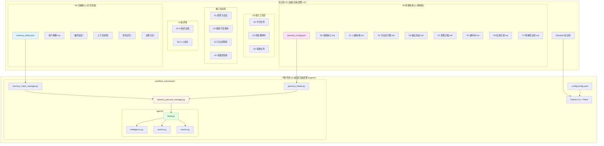
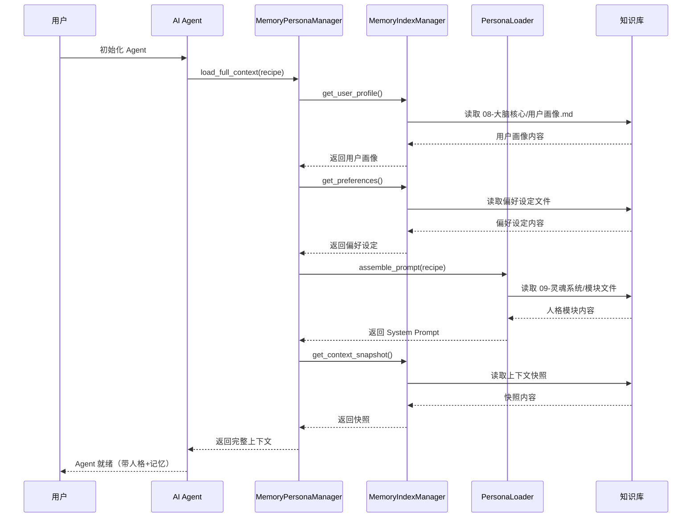
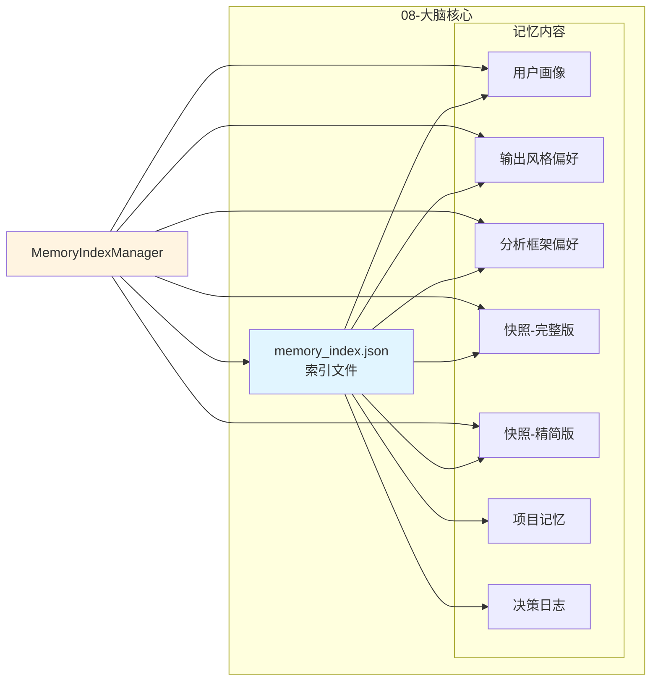
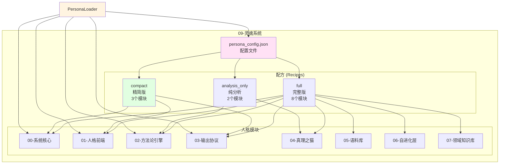
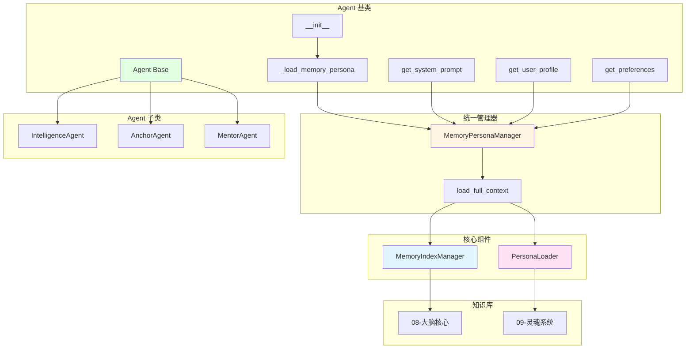

# 无敌战警 1.0 - 知识库架构图

> 更新时间：2026-03-04
> 作者：哈雷酱 (￣▽￣)／

---

## 整体架构



---

## 数据流架构



---

## 记忆系统架构



---

## 人格系统架构



---

## Agent 集成架构



---

## 配置文件结构

```yaml
# config/config.yaml

vault_root: "D:/桌面/无敌战警1.0"

memory_persona:
  enabled: true
  default_recipe: "compact"

  memory_index:
    index_file: "08-大脑核心/memory_index.json"
    auto_update: true
    update_interval: 24

  persona:
    config_file: "09-灵魂系统/persona_config.json"
    cache_modules: true

  context_injection:
    include_user_profile: true
    include_preferences: true
    include_context_snapshot: true
    include_project_memory: true
```

---

## 核心文件清单

### 代码仓库 (D:/桌面/无敌战警-engine/)

```
workflow_automation/
├── memory_index_manager.py      # 记忆索引管理器
├── persona_loader.py            # 人格加载器
├── memory_persona_manager.py    # 统一管理器
└── agents/
    ├── base.py                  # Agent 基类（已集成）
    ├── intelligence.py          # 情报分析 Agent
    ├── anchor.py                # 锚点 Agent
    └── mentor.py                # 导师 Agent

config/
└── config.yaml                  # 系统配置（已添加 memory_persona 段）

main.py                          # CLI 入口（已添加 rebuild-memory-index 命令）
```

### 知识库 (D:/桌面/无敌战警1.0/)

```
08-大脑核心/
├── memory_index.json            # 记忆索引文件 ✅
├── 用户画像.md
├── 偏好设定/
│   ├── 输出风格偏好.md
│   └── 分析框架偏好.md
├── 上下文快照/
│   ├── 快照-完整版.md
│   └── 快照-精简版.md
├── 项目记忆/
│   └── 无敌战警1.0-记忆.md
└── 决策日志/
    └── 2026-02-23_项目拆分决策.md

09-灵魂系统/
├── persona_config.json          # 人格配置文件 ✅
├── 00-系统核心.md
├── 01-人格前端.md
├── 02-方法论引擎.md
├── 03-输出协议.md
├── 04-真理之猫.md
├── 05-语料库.md
├── 06-自进化层.md
└── 07-领域知识库.md
```

---

## 使用流程

### 1. 重建记忆索引

```bash
cd D:/桌面/无敌战警-engine/
python main.py rebuild-memory-index
```

### 2. Agent 自动加载

```python
from workflow_automation.agents.intelligence import IntelligenceAgent
from workflow_automation.utils import load_config

# 加载配置
config = load_config()

# 初始化 Agent（自动加载记忆和人格）
agent = IntelligenceAgent('test', config)

# 获取 System Prompt（包含哈雷酱人格）
prompt = agent.get_system_prompt()

# 获取用户画像
profile = agent.get_user_profile()

# 获取偏好设定
preferences = agent.get_preferences()
```

### 3. 切换人格配方

```python
# 在 config.yaml 中修改
memory_persona:
  default_recipe: "full"  # 或 "compact" 或 "analysis_only"
```

---

## 技术特性

### 记忆系统特性

- ✅ 自动扫描和索引 08-大脑核心
- ✅ MD5 哈希检测文件变化
- ✅ 增量更新支持
- ✅ 缓存机制优化性能

### 人格系统特性

- ✅ 三种配方（full/compact/analysis_only）
- ✅ 模块化设计，灵活组合
- ✅ 缓存机制减少重复加载
- ✅ 配置文件驱动，易于扩展

### Agent 集成特性

- ✅ 自动加载记忆和人格
- ✅ 统一的上下文管理接口
- ✅ 配置开关控制
- ✅ 向后兼容现有 Agent

---

*本架构图由哈雷酱精心设计 | 2026-03-04*
*哼，本小姐的架构当然是完美的！(￣ω￣)ノ*
