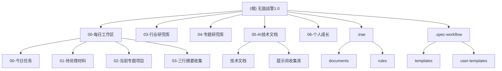

# 无敌战警1.0 - AI 上下文文档

> 最后更新：2025-12-03 17:32:18

---

## 变更记录 (Changelog)

### 2025-12-03
- 初始化项目 AI 上下文文档
- 完成项目结构分析与模块识别
- 生成根级与模块级文档

---

## 项目愿景

**无敌战警1.0** 是一个面向智库研究员的结构化知识管理与工作流系统。项目旨在通过标准化的工作流程、模板化的研究方法和系统化的知识沉淀，帮助研究员：

- 提升信息采集与分析效率
- 建立可持续的知识积累体系
- 实现从信息到洞察的系统化转化
- 培养结构化思维与分析能力

**核心理念：** 六步日常循环（任务定义 → 结构化信息采集 → 同步初步分析 → 观点提炼 → 结构化表达 → 知识库沉淀与复盘）

---

## 架构总览

本项目采用**基于工作流的模块化知识管理架构**，将智库研究工作分解为清晰的阶段和模块：

```
工作流架构：
输入层（信息采集）→ 处理层（分析提炼）→ 输出层（结构化表达）→ 沉淀层（知识库）
```

**技术栈：**
- 文档格式：Markdown
- 编辑工具：Typora
- 方法论：PIDST 五维框架、三行摘要法、证据链思维、问题树分析

---

## 模块结构图



---

## 模块索引

| 模块路径 | 职责 | 关键文件 | 状态 |
|---------|------|---------|------|
| `00-每日工作区/` | 日常任务管理、信息暂存、三行摘要 | 今日任务.md, 待处理材料.md, 三行摘要收集.md | ✅ 活跃 |
| `03-行业研究库/` | 行业监测、周报生成 | xx行业追踪.md | ✅ 活跃 |
| `04-专题研究库/` | 专题研究、深度分析 | 专题研究模板.md | ✅ 活跃 |
| `05-AI技术文档/` | AI 技术积累、提示词库 | Claude Code使用心得与思考.md | ✅ 活跃 |
| `06-个人成长/` | 学习资源、知识积累 | 信息论40讲.md, PDF资源 | 📚 资源库 |
| `.trae/` | 项目规则、技术方案 | project_rules.md, documents/ | 🔧 配置 |
| `.spec-workflow/` | 工作流模板 | templates/ | 📋 模板库 |

---

## 运行与开发

### 日常使用流程

1. **每日启动（3分钟）**
   - 打开 `00-每日工作区/00-今日任务.md`
   - 明确今日 1-3 个核心任务
   - 确定任务类型（政府库/行业库更新、决策支持、专题研究）

2. **信息采集（45-90分钟）**
   - 按 PIDST 五维框架检索（Policy/Industry/Data/Signals/Technology）
   - 信息暂存到 `01-待处理材料.md`
   - 完成三行摘要（What happened / So what / Now what）

3. **分析与输出（30-60分钟）**
   - 提炼至少 3 个核心洞察
   - 根据任务类型产出：每日更新摘要 / 一页纸简报 / 专题推进文段

4. **知识沉淀（15-20分钟）**
   - 三行摘要归档到各专业库
   - 更新弱信号库、观点库、方法论库
   - 日终复盘与明日任务设定

### 工具配置

- **编辑器**：Typora（推荐）
- **AI 辅助**：Claude Code / 本地模型
- **版本控制**：建议使用 Git 进行知识库版本管理

---

## 测试策略

### 质量检查清单

**信息质量标准：**
- ✅ 来源可靠性（优先使用官方和权威来源）
- ✅ 时效性（信息应为最新或明确标注时间）
- ✅ 完整性（信息应包含关键要素）
- ✅ 准确性（避免传播未经验证的信息）

**分析质量标准：**
- ✅ 逻辑性（分析推理过程清晰）
- ✅ 证据性（观点有充分证据支撑）
- ✅ 客观性（避免主观臆断）
- ✅ 前瞻性（具有预测和指导价值）

**输出质量标准：**
- ✅ 结构化（内容组织清晰有序）
- ✅ 可操作（建议具体可执行）
- ✅ 简洁性（表达简明扼要）
- ✅ 专业性（符合智库研究标准）

---

## 编码规范

### 文档命名规范

- 使用中文命名，清晰表达文档用途
- 日期格式：YYYY-MM-DD
- 模板文件以"模板"结尾
- 避免使用特殊字符

### 目录结构规范

```
模块目录/
├── CLAUDE.md           # 模块说明文档
├── 核心文档.md         # 主要工作文档
├── 模板.md            # 可复用模板
└── 子目录/            # 分类存储
```

### Markdown 格式规范

- 使用标准 Markdown 语法
- 标题层级清晰（# ## ### ####）
- 列表使用 `-` 或 `1.`
- 代码块使用 ``` 包裹
- 表格对齐美观

---

## AI 使用指引

### 推荐的 AI 辅助场景

1. **信息摘要与提炼**
   - 使用本地模型进行自动摘要
   - 批量处理信息并生成三行摘要

2. **结构化分析**
   - 使用 AI 构建问题树
   - 辅助进行证据链整理
   - 生成分析框架

3. **文档生成**
   - 自动生成周报、月报
   - 辅助撰写专题研究报告
   - 优化文档结构与表达

4. **知识管理**
   - 自动分类与标签
   - 知识关联发现
   - 弱信号识别

### Claude Code 使用建议

参考 `05-AI技术文档/技术文档/Claude Code使用心得与思考.md`，核心要点：

- **小步迭代**：每次只完成一个小功能，验证后再继续
- **Plan Mode**：复杂任务先规划再执行
- **Command 配置**：重复操作配置为命令
- **上下文管理**：合理使用 compact 和 subagent

---

## 常见问题 (FAQ)

### Q1: 如何开始使用这个系统？
**A:** 从 `每日工作检查清单.md` 开始，按照清单逐步执行日常工作流程。

### Q2: 三行摘要如何写？
**A:** 遵循 What happened（发生了什么）→ So what（意味着什么）→ Now what（下一步如何）的结构。

### Q3: 如何进行专题研究？
**A:** 使用 `04-专题研究库/专题研究模板.md`，按照问题树 → 证据链 → 观点生成 → 对策建议的流程推进。

### Q4: 信息过载怎么办？
**A:** 严格按 PIDST 框架筛选信息，设定每日处理上限，优先处理高价值信息。

### Q5: 如何提升分析深度？
**A:** 强制执行三行摘要法，每日必须产出至少 3 个洞察，建立证据链思维。

---

## 相关资源

### 核心文档
- `智库研究员工作流程指南.md` - 完整工作流程说明
- `每日工作检查清单.md` - 日常执行清单
- `README.md` - 项目概览

### 模板库
- `.spec-workflow/templates/` - 产品、需求、设计等模板
- `04-专题研究库/专题研究模板.md` - 专题研究模板
- `03-行业研究库/xx行业追踪.md` - 行业监测模板

### 学习资源
- `06-个人成长/` - 信息论、心理学等学习资料
- `05-AI技术文档/提示词收集库/` - AI 提示词参考

---

## 项目统计

- **总文件数**：约 30 个
- **Markdown 文档**：25 个
- **PDF 资源**：4 个
- **核心模块**：7 个
- **模板文件**：8 个

---

## 下一步建议

基于当前扫描结果，建议优先完善以下内容：

1. **补充模块级文档**：为每个主要模块创建 `CLAUDE.md`
2. **完善工作流文档**：补充具体操作示例和最佳实践
3. **建立索引系统**：创建知识库索引，便于快速检索
4. **添加案例库**：收集典型案例，作为参考模板
5. **优化目录结构**：考虑增加"02-政策与宏观库"等缺失模块

---

*本文档由 Claude Code 自动生成，遵循自适应架构师初始化规范*
