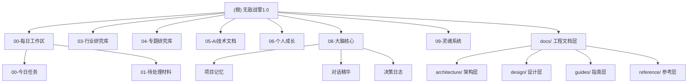

# 无敌战警1.0 - Obsidian 知识库

> 最后更新：2026-04-02

---

## 变更记录 (Changelog)

### 2026-04-02
- **文档工程化整理**：将所有工程文档迁移至 `docs/` 目录，统一分类管理
- 新增 `docs/architecture/` - 系统架构层（总览、架构图谱）
- 新增 `docs/design/` - 设计文档层（Subagent 架构、Gateway/Scheduler、宪法、Memory 治理）
- 新增 `docs/guides/` - 实施指南层（实施路线图、工程化建议）
- 新增 `docs/reference/` - 参考规范层（上下文注入契约）
- 删除根目录临时文件（`nul`、`未命名.*`）
- 重命名文档文件名去除版本后缀（`_v1` 等）

### 2026-02-23
- **仓库拆分**：代码迁移至 `D:/桌面/无敌战警-engine/`，本仓库仅保留 Obsidian 知识库
- 新增 08-大脑核心（记忆系统）、09-灵魂系统（KERNEL 人格 Obsidian 化）
- 新增 05-AI技术文档/提示词工程/（按类别重组提示词库）
- 创建全局 MOC 入口 `_MOC-知识库总览.md`
- 建立统一标签体系（类型/模型/状态/领域）

### 2025-12-03
- 初始化项目 AI 上下文文档
- 完成项目结构分析与模块识别

---

## 项目愿景

本仓库是面向智库研究员的 **Obsidian 知识库**，聚焦结构化知识管理与沉淀。

**核心理念：** 六步日常循环（任务定义 → 信息采集 → 初步分析 → 观点提炼 → 结构化表达 → 知识库沉淀与复盘）

**关联代码仓库：** `D:/桌面/无敌战警-engine/`（Python CLI + Flask RSS 网关 + Agent 系统）

---

## 工程文档索引

> 工程文档位于 `docs/` 目录，按用途分为四层。**所有设计文档均以 Markdown 格式维护，支持 Mermaid 图表渲染。**

| 层级 | 目录 | 内容 |
|------|------|------|
| **架构层** | `docs/architecture/` | 系统总览、架构图谱（Mermaid） |
| **设计层** | `docs/design/` | Subagent 架构、调度层、权限模型、记忆治理 |
| **指南层** | `docs/guides/` | 实施路线图、工程化建议 |
| **参考层** | `docs/reference/` | 上下文注入契约规范 |

详见：[docs/README.md](docs/README.md)

---

## 架构总览

```
知识库架构：
输入层（信息采集）→ 处理层（分析提炼）→ 输出层（结构化表达）→ 沉淀层（知识库）
```

**Subagent 网络架构（v2.0）**：
- **三核底座**：Persona Kernel（人格核）、Memory Kernel（记忆核）、Evolution Kernel（演进核）
- **代理层**：Copilot（主协调）+ 6 个核心 Subagent
- **调度层**：Gateway / Scheduler（入口网关、会话路由、代理分发、预算控制）

详见：[docs/architecture/README.md](docs/architecture/README.md)

---

## 模块结构图



---

## 模块索引

| 模块路径 | 职责 | 状态 |
|---------|------|------|
| `00-每日工作区/` | 日常任务管理、信息暂存、三行摘要 | 活跃 |
| `01-研究方法论/` | 研究方法论积累 | 资源库 |
| `02-政策于宏观库/` | 政策与宏观信息 | 活跃 |
| `03-行业研究库/` | 行业监测、周报生成 | 活跃 |
| `04-专题研究库/` | 专题研究、深度分析 | 活跃 |
| `05-AI技术文档/` | AI 技术积累、提示词库 | 活跃 |
| `06-个人成长/` | 学习资源、知识积累 | 资源库 |
| `08-大脑核心/` | 记忆系统 — AI 跨会话记忆 | 活跃 |
| `09-灵魂系统/` | 人格系统 — KERNEL 人格 Obsidian 化 | 活跃 |
| `docs/` | 工程文档 — 架构/设计/指南/参考 | 新增 |

---

## 工程文档结构

```
docs/
├── README.md                    # 文档索引（入口）
├── architecture/
│   ├── README.md               # 系统架构总览
│   └── diagrams.md              # 架构可视化图谱（Mermaid）
├── design/
│   ├── 01-subagent-architecture.md    # Subagent 架构与调度层设计
│   ├── 02-gateway-scheduler.md        # Gateway/Scheduler 详细设计
│   ├── 03-subagent-constitution.md    # Subagent 宪法与权限模型
│   └── 04-memory-governance.md       # Memory 权限模型与写回治理
├── guides/
│   ├── implementation-roadmap.md      # 总体实施路线图
│   └── engineering-guide.md           # 工程化落地建议
└── reference/
    └── context-injection-contract.md  # 上下文注入契约规范
```

---

## 文档规范

- 使用中文命名，清晰表达文档用途
- 日期格式：YYYY-MM-DD
- 使用标准 Markdown 语法 + Obsidian 双链 `[[]]`
- Mermaid 图表用于架构可视化
- 标题层级清晰（# ## ### ####）
- 文档头部使用 YAML frontmatter 标注版本、作者、状态

---

## 下一步计划

### 智能体与知识库深度集成

**目标**：建立 08-大脑核心、09-灵魂系统与 AI 智能体之间的索引和规则关系

**核心任务**：
1. **记忆系统索引化**
 - 建立 08-大脑核心的结构化索引机制
 - 实现跨会话记忆的自动检索和加载
 - 优化用户画像、偏好设定、上下文快照的调用逻辑

2. **人格系统规则化**
 - 将 09-灵魂系统（哈雷酱人格）与智能体输出协议深度绑定
 - 建立人格特质的动态适应机制
 - 实现基于用户反馈的人格微调系统

3. **知识库智能化**
 - 提升知识库内容与智能体交互的适配度
 - 建立知识条目的自动标注和关联系统
 - 优化知识检索的精准度和响应速度

**技术方案**：
- 使用 BMad-Method 工作流进行系统化开发
- 结合 MCP 协议实现记忆和人格的动态加载
- 建立标准化的索引和规则文件格式

---

## 常见问题 (FAQ)

### Q1: 如何开始使用这个系统？
**A:** 从 `每日工作检查清单.md` 开始，按照清单逐步执行日常工作流程。

### Q2: 三行摘要如何写？
**A:** 遵循 What happened → So what → Now what 的结构。

### Q3: 代码仓库在哪里？
**A:** `D:/桌面/无敌战警-engine/`，详见其 README.md。

### Q4: 工程文档在哪里？
**A:** 所有工程设计文档统一位于 `docs/` 目录。从 [docs/README.md](docs/README.md) 开始浏览。

---

*本文档由 Claude Code 维护*
