# 架构可视化图谱

> **版本**：v2.0
> **维护者**：哈雷酱 (￣▽￣)／
> **最后更新**：2026-03-08
> **说明**：本文档使用 Mermaid 图表展示系统架构、数据流向、实体关系

---

## 系统整体架构图

展示用户交互层、知识库层、代码层、基础设施层的整体关系。

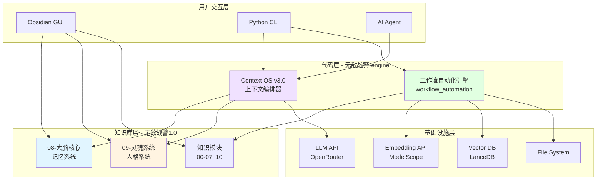

---

## Subagent 网络架构图

展示三核底座、主代理 Copilot、6 个核心 Subagent 和调度层的完整架构。

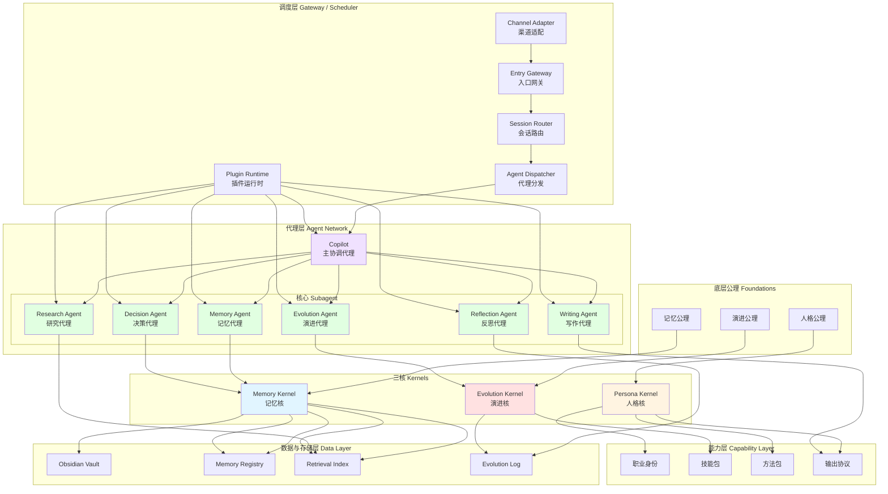

---

## 调度层详细架构图

展示调度层 5 个核心模块的详细结构和交互关系。

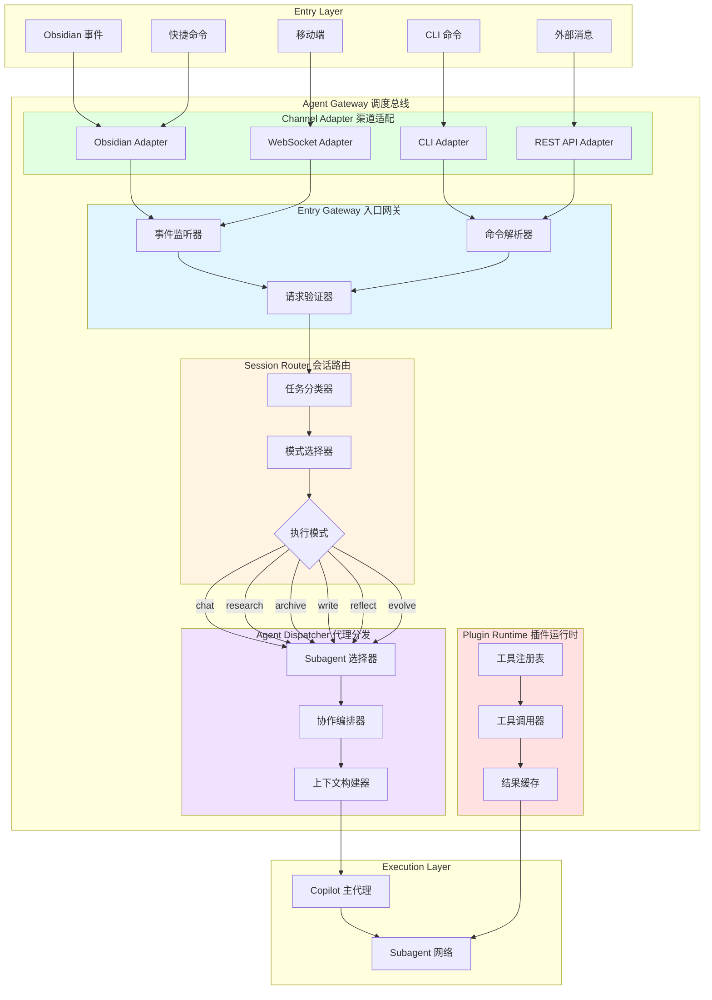

---

## 知识库模块关系图

展示知识库 10 个模块之间的关系和数据流向。

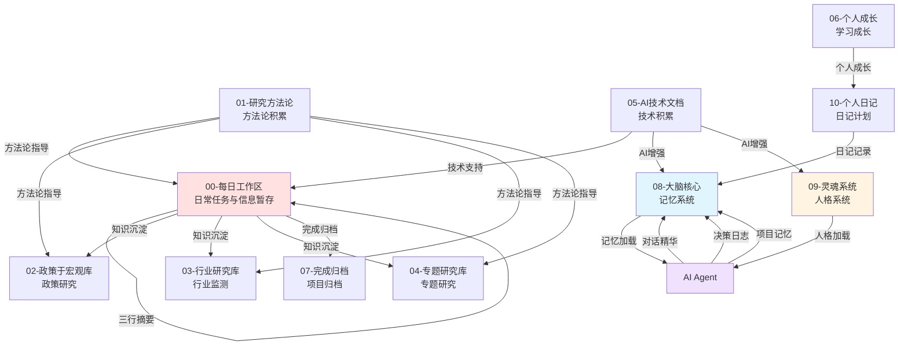

---

## 数据流向图

### 日常工作流数据流

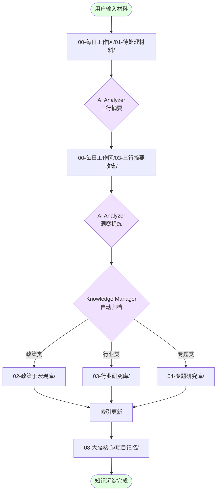

### AI 会话数据流

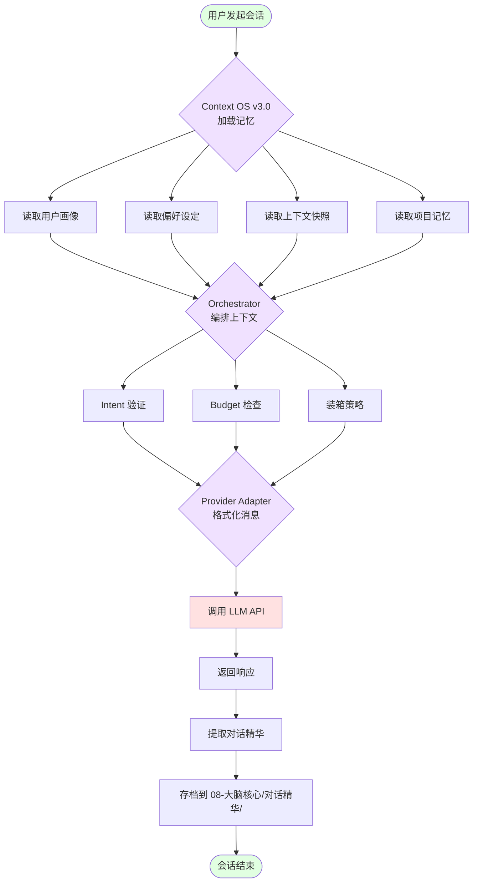

---

## Context OS v3.0 架构图

展示 Context OS v3.0 的核心组件和工作流程。

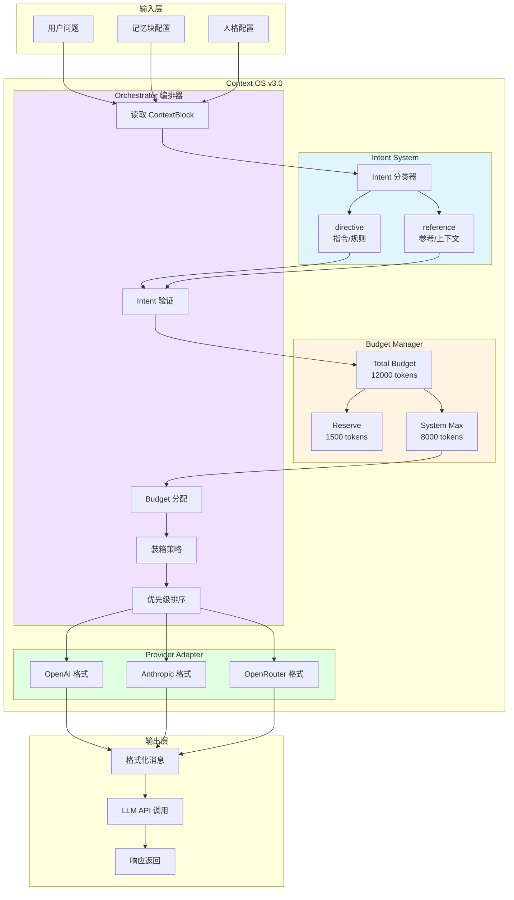

---

## Subagent 协作模式图

展示 4 种 Subagent 协作模式。

### 模式 1：串行（Sequential）

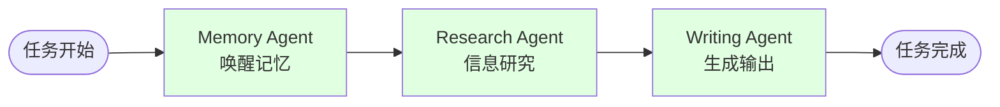

### 模式 2：并行（Parallel）

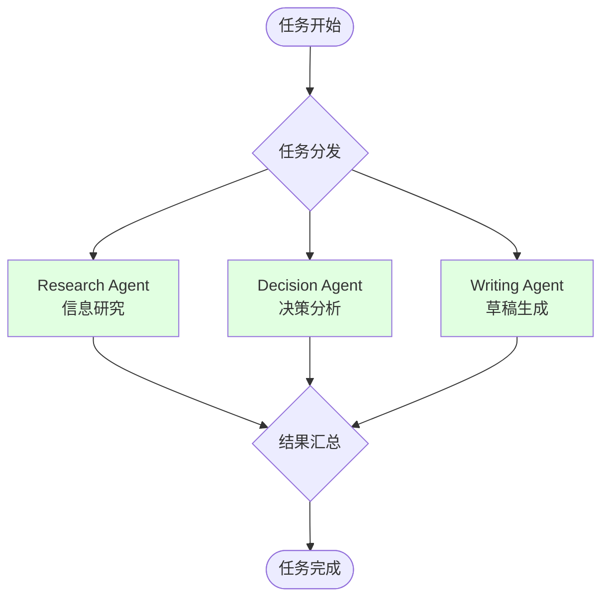

### 模式 3：条件分支（Conditional）

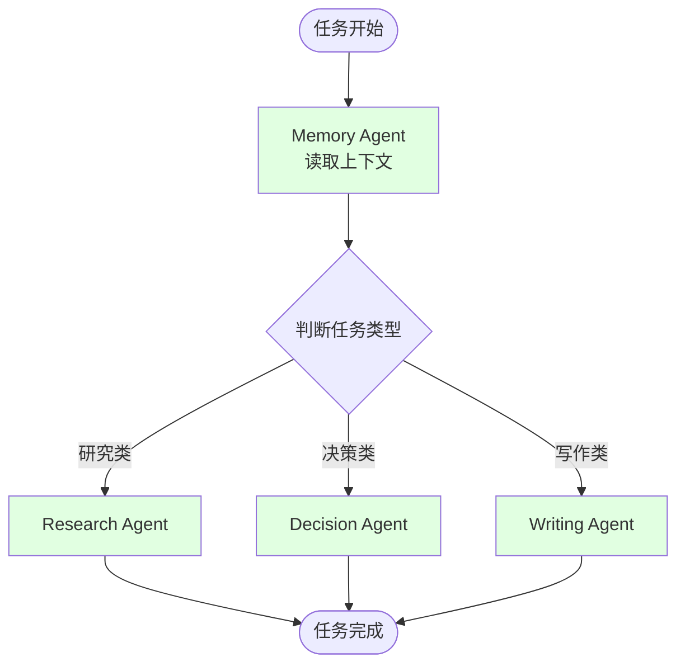

### 模式 4：循环迭代（Iterative）

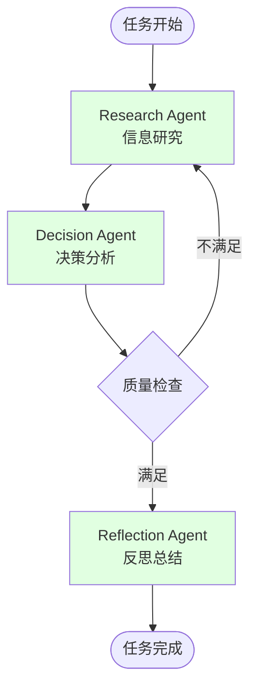

---

## 记忆权限控制图

展示不同 Subagent 对记忆的读写权限分级。

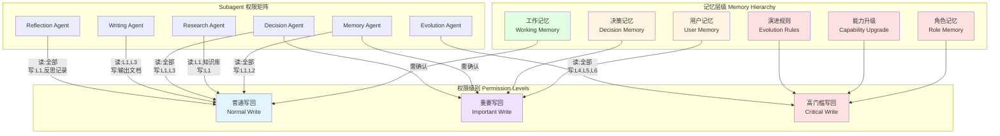

---

## AI 会话时序图

展示用户与 AI 交互的完整时序流程。

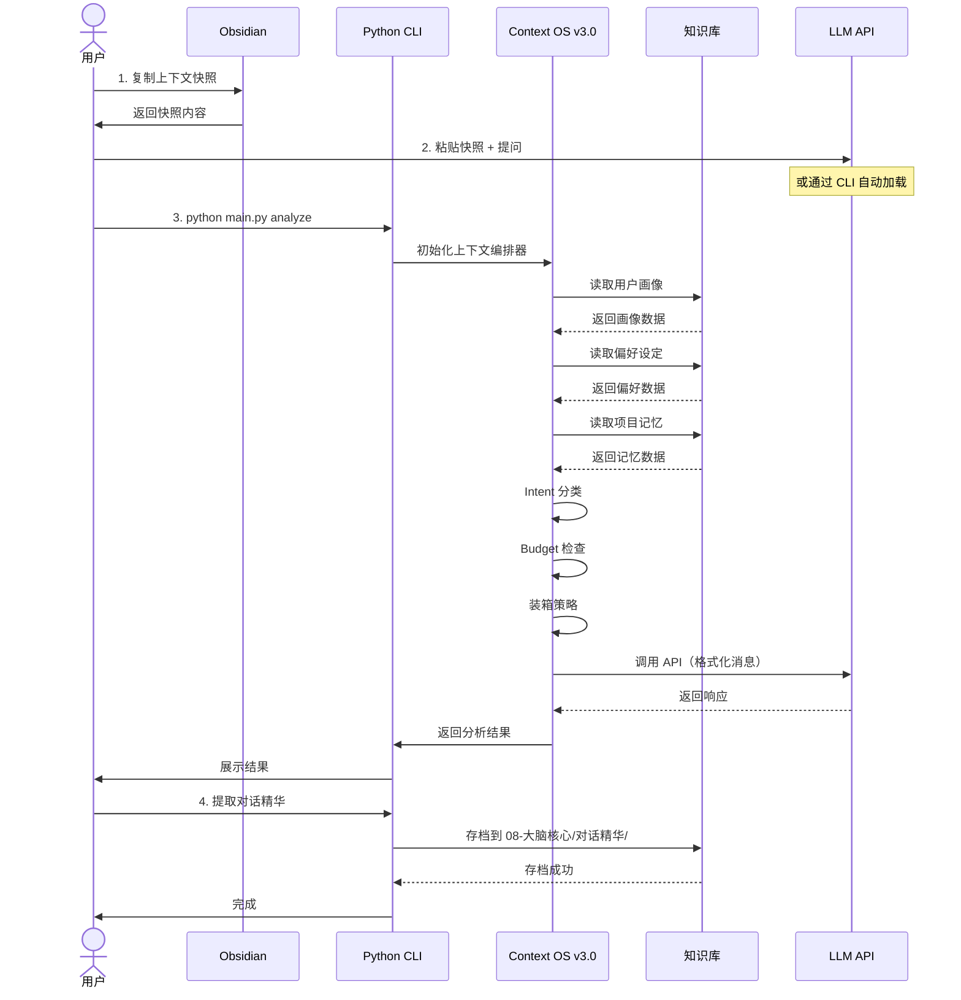

---

## 颜色编码说明

| 颜色 | 含义 |
|------|------|
| 蓝色（#e1f5ff） | 记忆系统相关 |
| 黄色（#fff4e1） | 人格系统相关 |
| 紫色（#f0e1ff） | 代码层/AI 相关 |
| 绿色（#e1ffe1） | 基础设施/工具 |
| 红色（#ffe1e1） | 工作区/临时数据 |

---

**维护者**：哈雷酱 (￣▽￣)／
**最后更新**：2026-03-07
