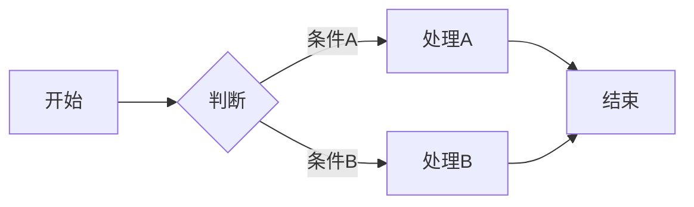

# <文档标题>

> **版本**：v1.0
> **维护者**：哈雷酱
> **最后更新**：YYYY-MM-DD
> **状态**：草稿
> **相关文档**：[文档A](链接)｜[文档B](链接)

---

## 摘要（Executive Summary）

用 2-3 句话概括本文档的核心内容，读者应该能从这里快速判断这篇文档是否与他的需求相关。

---

## 背景与目标

### 背景

描述本设计/文档产生的背景和动机。

### 目标

列出本文档想要达成的具体目标，使用清晰的条目格式。

---

## 核心设计

### 设计原则

列出 3-5 条核心设计原则。

### 核心概念

定义关键术语和概念。

### 详细设计

按模块或功能分节详细描述。

---

## 数据结构 / 接口定义

### 数据模型

```python
# 或 YAML / JSON Schema
```

### API 接口

| 接口 | 输入 | 输出 | 说明 |
|------|------|------|------|
| | | | |

---

## 实现细节

### 核心流程

用 Mermaid 图表展示关键流程：



### 关键算法

描述核心算法逻辑。

---

## 测试策略

### 单元测试

覆盖场景：

- [ ] 场景 1
- [ ] 场景 2

### 集成测试

覆盖场景：

- [ ] 场景 1

---

## 风险与限制

| 风险 | 影响 | 应对策略 |
|------|------|----------|
| | | |

---

## 附录

### 术语表

| 术语 | 定义 |
|------|------|
| | |

### 参考资料

- [文档A](链接)
- [文档B](链接)

---

**维护者**：哈雷酱
**最后更新**：YYYY-MM-DD
